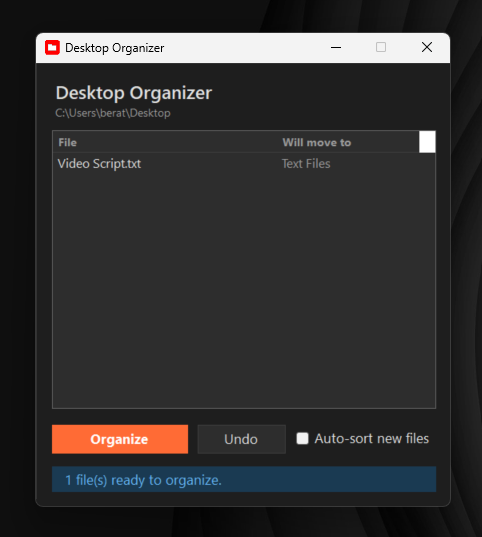
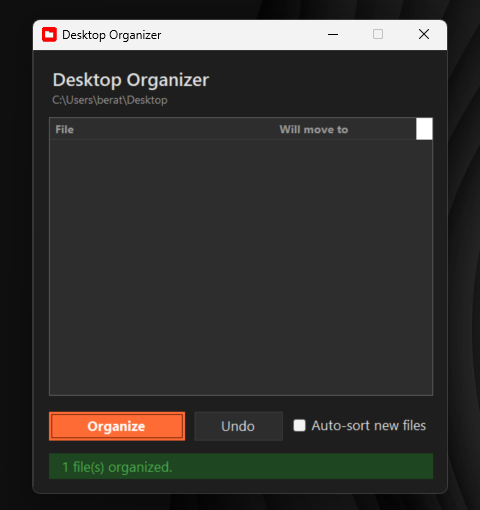

# Desktop Organizer

A Windows app that keeps your desktop clean by sorting loose files into categorized folders — Images, PDFs, Documents, Videos, and more — with one click, or automatically as new files land.

| Before — preview of what will move | After — one click later |
|---|---|
|  |  |

## Features

- **One-click organize** — scans the desktop and moves each file into a folder matching its type
- **Preview first** — see exactly what will move where before anything happens
- **Undo** — restores every file to its original location, and removes any folders the operation had created
- **Auto-sort** — optional background watcher that organizes new files seconds after they appear
- **System tray** — closing the window keeps the app running in the tray; organize, undo, and settings are available from the tray menu
- **Custom categories** — edit which extensions go to which folder in the Settings dialog; your mapping is saved and survives restarts
- **Safe by design** — folders on the desktop are never touched, hidden and system files are skipped, name conflicts are resolved by renaming (never overwriting), and locked or open files are skipped with a warning

## Download

Grab `DesktopOrganizer.exe` from the [latest release](../../releases/latest). No installation and no .NET runtime required — download and run.

> **Note:** the app is not code-signed, so Windows SmartScreen may warn on first run. Click **More info → Run anyway**.

## How it works

Files are matched by extension to a category folder created on the desktop itself:

| Category | Extensions |
|---|---|
| Images | jpg, jpeg, png, gif, bmp, webp, svg, ico, tiff, heic |
| PDFs | pdf |
| Documents | doc, docx, rtf, odt |
| Text Files | txt, md |
| Spreadsheets | xls, xlsx, csv, ods |
| Videos | mp4, mov, avi, mkv, wmv, webm, flv |
| Audio | mp3, wav, flac, aac, ogg, m4a, wma |
| Archives | zip, rar, 7z, tar, gz, iso |
| App Shortcuts | lnk, url, appref-ms |
| Other | anything unmatched |

All categories are editable in **Settings** (tray icon → Open Settings). Custom mappings are stored in `%LocalAppData%\DesktopOrganizer\settings.json`.

## Building from source

Requires the [.NET 10 SDK](https://dotnet.microsoft.com/download) on Windows.

```
git clone <this repo>
cd DesktopOrganizer
dotnet build DesktopOrganizer
```

Or open `DesktopOrganizer.slnx` in Visual Studio 2022+ and press F5.

To produce the self-contained single-file executable:

```
dotnet publish DesktopOrganizer -c Release -r win-x64 --self-contained -p:PublishSingleFile=true
```

The full design and implementation plan is in [DesktopOrganizer_ProjectSpec.md](DesktopOrganizer_ProjectSpec.md).

## License

[MIT](LICENSE)
